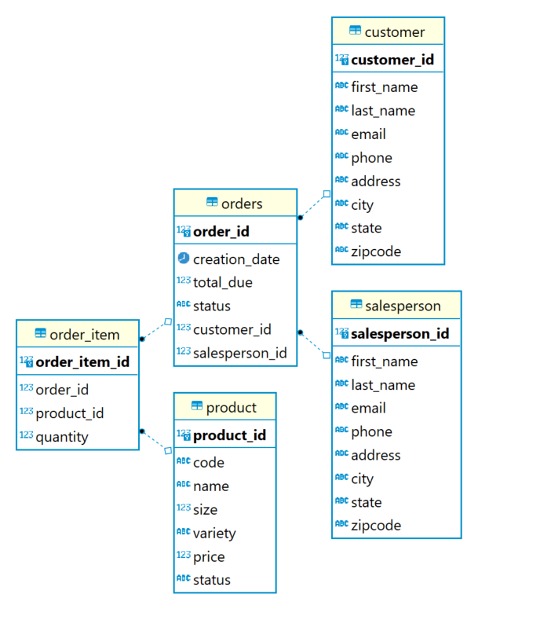
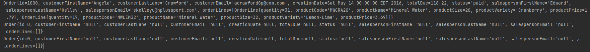

# Introduction - JDBC App
The JBDC application leverages the JDBC driver APIs, one of the most used and fundamental java libraries, to connect to a database to access data from the Java application.  
The application uses `JDBC` to provide a connection between the java application and a database in Postgres SQL server running on a `Docker` container using the Postgres Image. The database contains sales order information. The project is packaged using `Maven`.  
# Implementaiton
## ER Diagram
ER diagram of all the tables in hplussport Database:  

## Design Patterns
This application uses the DAO pattern, one of the most common patterns when dealing with a  database. Data access objects, or DAOs, provide an abstraction layer between raw JDBC code and the business logic. This pattern supports multiple tables. The DAO pattern can provide a solid encapsulation of complex joins and aggregations. 
  
The other most common pattern is the Repository pattern. This pattern focuses only on single table access per class. Unlike DAO pattern, the Repository pattern performs operations like 'joins' in the code. One main advantage with Repository pattern is that it allows for distributing the database and hence allowing for horizontal scaling.  

Both the patterns work in modern systems. Choosing between one comes down do to where the data processing needs to be done. Developers focused on SQL find value in DAO pattern and others find it easier to use Repository pattern.

# Test
How you test your app against the database? (e.g. database setup, test data set up, query result)  
The PostgreSQL server created using Docker container was populated with the sample data using the sql scripts.  
Using `JDBCExecutor.java`, a connection was established with Postgres Server. The application uses `CustomerDAO` and `OrderDAO` to do CRUD operations using the sample data created using `Customer` and `Order` objects.  

The following screenshot is an output of data pulled from database using `OrderDAO`:  

