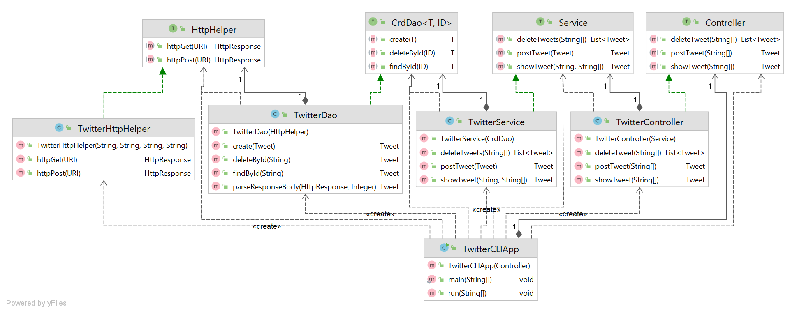

# Introduction - Twitter CLI App
The Twitter CLI tool aims to provide the user with basic operations like Post, show, and delete tweets to manage their Twitter account from the comfort of command line directly.  
This application makes use of Twitter REST API and HTTP Client library to perform Create, Read and Delete operations on tweets. The project is built and structured using
Maven and Springboot. The app uses the DAO design pattern to deal with the data exchanged. The app is deployed using Docker on DockerHub.

# Quick Start
- Packaging app using Maven:  
    `mvn clean package -Dmaven.test.skip=true`  

- Running App using Docker:
  - Pull docker image from DockerHub:  
    `docker pull saiprateekreddy96/twitter`
  - Run container :  
    ```
    docker run --rm \
    -e consumerKey=YOUR_VALUE \
    -e consumerSecret=YOUR_VALUE \
    -e accessToken=YOUR_VALUE \
    -e tokenSecret=YOUR_VALUE \
    saiprateekreddy96/twitter post|show|delete [options]
    ```
  Options:  
    - Create/post: tweet_text latitude:longitude
    - Read/show: tweet_id [field1,field2 ...]
    - delete: [id1, id2, ...]
    

# Design
## UML diagram
  
The UML diagram highlights the following five main components of the application :
### App/Main
The `main()` function takes in the arguments and passes them to the controller layer. The `run()` function parses the 
arguments and calls the appropriate methods in the controller layer and prints the tweet(s) returned by them.
### Controller
The Controller layer consumes the input argument, parses them, and validates them to be in the correct format.
It then calls the corresponding service layer method.
### Service
The service layer implements the business logic of the application. It is responsible to check that 
1. when posting a tweet, the text must not exceed 140 characters and the latitude and longitude values must not be out of range.
2. when searching for a tweet, the id should be in correct format and, the tweet fields, is any, should be valid.
3. when deleting a tweet, the id or ids supplied must be in correct format
### DAO
The DAO or Data Access Layer is responsible for handling the data coming from the Twitter REST APIs. The data is acquired from 
Twitter APIs using the TwitterHttpHelper class.
### TwitterHttpHelper
This class uses the corresponding URI to execute the HTTP requests made to the Twitter APIs and return the response data to the DAO 
layer.
## Models
In the DAO model, to encapsulate the Tweet data returned in JSON format by the Twitter APIs , we use
the Tweet POJO class. The Tweet model class's private member variables represent the JSON elements and inner
objects. The inner objects also have separate models to represent them. The Models use the TweetUtil methods to 
parse the JSON string to object of Tweet Class and vice versa.
## Spring
With an increase in number of Dependencies in an application, it becomes harder
to manually set all the dependencies and track them. One of the most common framework
that solves the Dependency problem is the Spring framework. In this project,
we use SpringBoot, an extension of the Spring framework, to simplify managing 
dependencies. In our application we have 4 Beans, `TwitterController`, `TwitterService`,
`TwitterDao`,and `TwitterHttpHelper`; set as Beans using `@Controller`, 
`@Service`, `@Repository` and `@Component` annotations respectively. The `TwitterCLISpringBoot` application, marked using
`@SpringBootApplication`, manages the dependencies by injecting dependencies using the '@Autowired' annotation used on
every Constructor of dependent classes.

# Test
The application uses the Junit4 and mockito framework for testing. Every layer 
of the application was tested using Junit4 for Integration tests and Unit tests.
To completely isolate the tested layer from other in unit testing, we use the Mockito mocking library
along with Junit4 to mock all dependencies.

## Deployment
After packaging the project into a JAR file using Maven, a Dockerfile which
uses `openjdk:8-alpine` as a base image along with project JAR file to create a Docker image. 
The Image is configured to run the main class of the JAR file as an Entry point.
The image was then pushed to the DockerHub for easy deployment.

# Improvements
- Use the user's location as "lon:lat" to post tweets instead of the user having to supply
  them manually.
- As Twitter does not allow same tweet to be posted twice, this action can be handled locally
  for better user experience.
- Allow the application to show multiple tweets by taking multiple id input along with optional fields.

