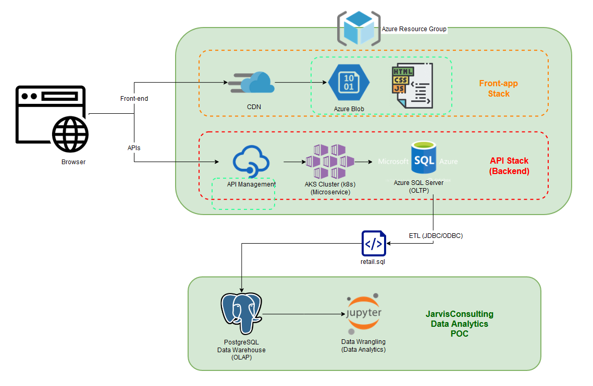

# Introduction
London Gift Shop (LGS) is an online gift-ware store in London, UK. The Store has been underdeveloping in terms of revenue in the recent years. The LGS marketing team has collaborated with Jarvis to use IT based data analysis to study their customer shopping behavior.  
The LGS marketing will use the analytics to develop better sales and marketing strategies to retain existing customers and attract new customers.    

This Proof-of-Concept project utilizes Python Jupyter Notebook and various python libraris like; `Pandas`, `Numpy` and `MatPlotLib`; to perform data analysis and data visualization. Client retail data was loaded into a PostgreSql Database and later imported to Jupyter Notebook. 

# Implementaion
## Project Architecture
LGS's sytem maintains their web application, both front-end and backend in an integrated Microsoft Azure Environment. After dumping the client's personal information using an ETL process, the LGS IT team has provided the Jarvis team with the transaction data from the year 2009 to 2011 into the `retail.sql` file. The file is used to store the data into a PostgresSql Database and the data is analysed and visualized using a Jupyter Notebook.  

## Data Analytics and Wrangling
- Jupyter Notebook: [retail_data_analytics_wrangling.ipynb](retail_data_analytics_wrangling.ipynb)
- Total Invoice Amount Distribution: These graphs show the distribution of total invoice amount of each customer.
- Monthly Placed and Cancelled Orders: This bar graph compares the number of cancelled and placed orders in each month.
- Monthly Sales: This line graph shows the trends in number of sales per month over time.
- Monthly Sales Growth: This line graph shows how the monthly sales Growth percentage changes over time.
- Monthly Active Users: This bar graph shows the number of active users for each month.
- New and Existing Users: This bar graph shows the number of new and active users for each month.
- *RFM Segmentation*:
Recency, Frequency and Monetary(RFM) Score is a way to determine marketing and sales strategies based on customer habits. 
    - Recency: Time since customer last purchase
    - Frequency: Total number of purchases.
    - Monetary: Total spending by the customer.  

    Out of the 10 segments based on Recency and Frequency score, 3 segements are of main focus:  

    - Can't Lose Segment: There are 71 customers in this segment. These customers were making on an average 16 puchases by spending an average of &euro; 8356 but,  have not bought from the shop in a long time. LGS can provide exclusive deals on products often purchased in the past and recommend similar products. 
    - Hibernating Segment: There are 1528 customers in this segment. These customers have not made purchases in a long time. LGS can offer exclusive discounts to attract these customers to make purchases.
    - Champions Segment: There are 852 customers in this segment.These customers are reponsible for most of the revenue. LGS can implement campaingns to ensure continuity of shopping for these customers.

# Improvements
- Project future sales 
- Use more recent data to understand trends in the data to make better predictions.
- Include demographics data to improve Operations and Logistics
