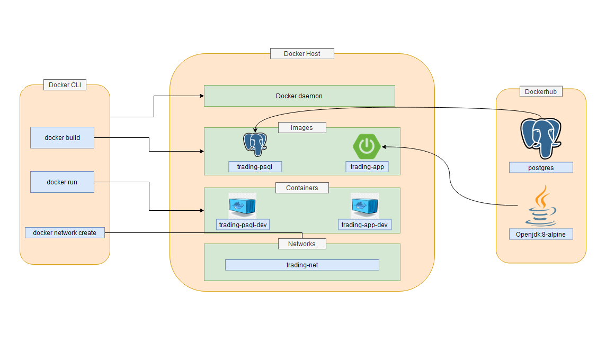

Table of contents
* [Introduction](#Introduction)
* [Quick Start](#QuickStart)
* [Implementation](#Implementation)
* [Test](#Test)
* [Deployment](#Deployment)
* [Improvements](#Improvements)

# Introduction
Jarvis's trading team wants to replace the existing monolithic application with a new microservice application.
This application provides a PoC (Proof of Concept) for the trading application. The application focuses on
the features such as managing trade accounts and clients and, pull and post market data.  
The application was written in Java using the Spring framework. It was packaged using Maven. The psql database with a database initialization
script and the spring application was deployed using Docker.

# Quick Start
- Prequiresites: Docker, CentOS 7
- Steps to start application
    - pull docker images from Dockerhub:  
      ```
      $ docker pull saiprateekreddy96/trading-psql
      $ docker pull saiprateekreddy96/trading-app
      ```
    - create a docker network:  
      ```
      sudo docker network create trading-net
      ```
    - start containers:
      ```
      #Run database
      docker run -d --rm --name trading-psql-dev \
      -e POSTGRES_PASSWORD=password \
      -e POSTGRES_DB=jrvstrading \
      -e POSTGRES_USER=postgres \
      --network trading-net \
      -d -p 5432:5432 saiprateekreddy96/trading-psql
      
      IEX_PUB_TOKEN="YOUR_TOKEN"
      
      #Run app
      docker run -d --rm --name trading-app-dev \
      -e "PSQL_HOST=trading-psql-dev" \
      -e "PSQL_DB=5432" \
      -e "PSQL_DB=jrvstrading" \
      -e "PSQL_USER=postgres" \
      -e "PSQL_PASSWORD=password" \
      -e "IEX_PUB_TOKEN=${IEX_PUB_TOKEN}" \
      --network trading-net \
      -p 8080:8080 -t saiprateekreddy96/trading-app
      ```
- Try trading-app with SwaggerUI:  
  `http://localhost:8080/swagger-ui.html`  
  


# Implementation
## Architecture

- The application follows the MVC architecture and consists of the following components:  
    - Controller layer: The controller layer deals with the user HTTP requests. It maps the REST API calls the 
      user makes to corresponding methods in the class. The controller reads the input from the
      HTTP requests and passes it to the service layer.
    - Service layer: The service layer is where the business logic resides. It ensures that the 
      given input is valid and then sends the request down to the DAO layer.
    - DAO layer: The DAO layer takes the requests from the service layer and connects to the database
      to perform required operations. The result of the operations(if any) in the correct format
      is sent back to the service layer. The DAO uses JDBC to connect to the Database and perform SQL queries.
    - SpringBoot: The application uses Springboot to create the microservices with the help of Apache Tomcat's
      webservlet. The dependencies are also managed by Springboot.
    - PSQL and IEX: This application uses PostgreSQL database to store the data. However, the application can
      persist the data in any datasource due to the use of JDBC datasource library. The IEX cloud is a web API
      that contains current stock information. All the application's market data was obtained using the IEX Cloud
      API endpoints.

## REST API Usage
### Swagger
Swagger is a UI tool that allows us to create interfaces for our REST APIs. 
It provides a visual representation of our API, allowing clients to get a better sense of the PoC.
### Quote Controller
- The Quote controller gets the market data from IEX cloud and stores it in the Database. It has the following
  endpoints:
    - GET `/quote/dailyList`: list all securities that are available to trade.
    - GET `/quote/iex/ticker/{ticker}`: Show IEX quote with the given ticker.
    - PUT `/quote/ticker/{ticker}` : Add a new ticker to the daily list.
    - POST `/quote`: Update a quote in the quote table.
    - POST `/quote/iexMarketData`: Update the quote table using IEX market data.
### Trader Controller
- The Trader controller manages trader and account information.It can create and delete traders. It can also deposit and withdraw fund from a given account. It has
the following endpoints:
    - DELETE `/trader/traderId/{traderId}`: Delete a trader with a given trader ID.
    - POST `/trader`: Create a trader.
    - POST `/trader/firstname/{firstname}/lastname/{lastname}/dob/{dob}/country/{country}/email/{email}`: Create a trader with given inputs
    - PUT `/trader/deposit/traderId/{traderId}/amount/{amount}`: Deposit money into an account.
    - PUT `/trader/withdraw/traderId/{traderId}/amount/{amount}` : Withdraw money from an account.

# Test
The controllers, services and DAO's were integration tested using Junit 4. All the tests were checked to achieve a code
coverage of at least 65%. A test database was set up in PostgreSQL and configured using Spring to allow
testing of each class of the application.

# Deployment

The application is deployed using two images, one for application and the other for database.
- trading-psql: This image was built using `postgres` image as base image and a startup script to initialize
the database.
- trading-app: This image was built using `openjdk-8:alpine` as base image and the maven packaged JAR file of the application.
The JAR file was used as the entry point of this image.

# Improvements
- Implement Orders controller, and a Dashboard to improve the usability of the application.
- Update the daily list automatically in database by pulling from the IEX cloud without having the user
to call the endpoint.
- Expand the application to use various stock exchanges like NASDAQ or NYSE. It helps the application expand
to a wide range of users.